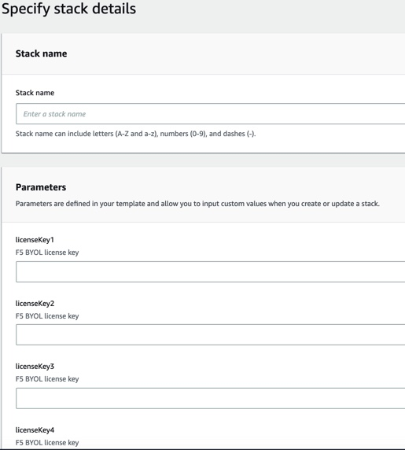
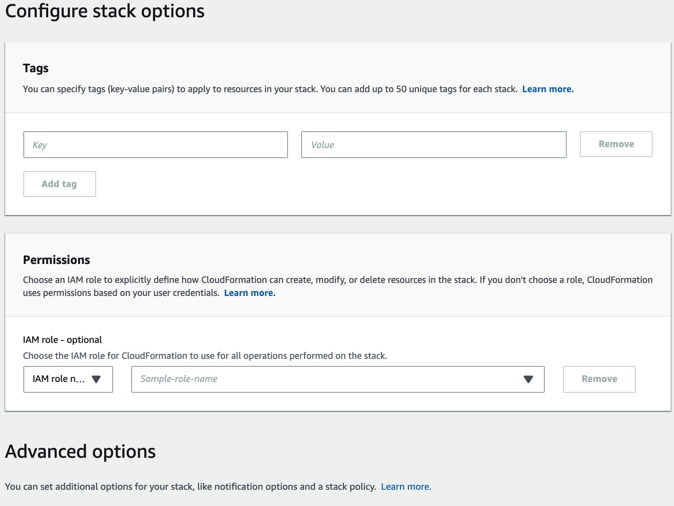

# f5-sca-securitystack

This README will provide a baseline introduction into the Secure Cloud Architecture (SCA). Links will be provided for more in-depth explanations.

## Contents
- [Introduction](#introduction)
- [What is Secure Cloud Architecture (SCA)?](#secure-cloud-architecture)
- [Design Principles](#design-principles)
- [Business Outcomes](#business-outcomes)
- [What is included in this template?](#What-is-included-in-this-template)
- [Getting Help](#help)
- [Installation](#installation)
- [Template Parameters](#template-parameters)

## Introduction

The biggest challenge in cloud computing today is the security and privacy problems caused by its multi-tenancy nature and the outsourcing of infrastructure. Enterprises are rapidly adopting cloud services for their businesses and measures need to be developed so that organizations can be assured of security in their businesses, and can choose a suitable vendor for their computing needs. 

Cloud computing relies on the internet as a medium for users to access the required services at any time on pay-per-use model. However, this technology is still in its initial stages of development and suffers from threats & vulnerabilities that prevents users from trusting it. Various malevolent activities from malicious users have threatened this technology such as data misuse and illegitimate access control. The occurrence of these threats may result in damaging or unauthorized access of critical & confidential data of users. 

## Secure Cloud Architecture
 
The purpose of Secure Cloud Architecture (SCA) is to provide a barrier of protection between your mission-critical apps & sensitive data and the Cloud Service Provider. Even when information resides in a Cloud Service Provider (CSP), there must be requirements to protect your information. SCA focuses on delivering a concept to migrate to the cloud with security as a priority, not an after thought.

This project originated because of the Department of Defense (DoD) requirements to protect the Defense Information System Networks (DISN) and DoD Information Networks (DoDIN), even when living in a Cloud Service Provider (CSP). Per the SCCA Functional Requirements Document, the purpose of SCCA is to provide a barrier of protection between the DISN and commercial cloud services used by the DoD.

“It specifically addresses attacks originating from mission applications that reside within the Cloud Service Environment (CSE) upon both the DISN infrastructure and neighboring tenants in a multi-tenant environment. It provides a consistent CSP independent level of security that enables the use of commercially available Cloud Service Offerings (CSO) for hosting DoD mission applications operating at all DoD Information System Impact Levels (i.e. 2, 4, 5, & 6).” 
https://iasecontent.disa.mil/stigs/pdf/SCCA_FRD_v2-9.pdf

## Design principles

Security is built-in, …

## Business Outcomes

The Application Economy is not driven by humans or physical assets. It is driven by the ability to scale and secure digital services, such as your applications. To thrive in the Application Economy, organizations need to manage, secure, and optimize their applications. 
 
Secure cloud architecture (SCA) for organizations can strengthen the security of your applications and sensitive data, thus minimizing enterprise risks. 

## What is included in this template? 

The Secure Cloud Architecture (SCA) provides a 3-Tier architecture. This architecture has the following components:

5 subnets:
1. Management 
2. "Outside" 
3. DMZ #1
4. DMZ #2 
5. "Internal" 

**Below is an image of the architecture:**     

  

Tier 1 and Tier 3 are F5 BIG-IP devices (HA via API), while Tier 2 IPS is a Ubuntu box with routing enabled. The reason of this is to allow flexibility in Tier 2 so that the customer is not locked into a F5 device. 

There is a root Cloud Formation Template (CFT) which runs many child CFT's.   

 

1. The TGW (transit gateway) and VPC (virtual private cloud) are deployed.
2. The template for the jump host and IPS to be deployed. 
3. BIG-IP is deployed in Tier 1 and Tier 3.  
**Note**: This is created after the jump host and IPS because 1 of the inputs to this is a private IP of the jump host
4. Routes are replaced utilizing lambda functions since it's not natively allowed
5. The AS3 Update template updates AS3 

## Help
**under construction**

## Installation

1. Navigate to your AWS Management Console.
2. Go to 'Services' -> 'CloudFormation'.
3. Click 'Create Stack' under the 'Stacks' column.
4. Under 'Prerequisite', choose 'Template is ready'.    
   
5. Under the Specify template, for 'Template source' choose 'Upload a template file'.  
   
6. Click 'choose file' and find the appropriate file on your local machine, then click next.
7. You should now see the following page:   
   
8. The 'Stack name' can be anything you choose. The stack name can include letters (A-Z and a-z), numbers (0-9), and dashes (-).
9. Fill in the appropriate information for the template parameters. For more information regarding the template parameters, [see below](#template-parameters). When you are finished with the template parameters, click 'Next'. 
10. You should now see the following page:   
   
11. Under 'Advanced Options', expand the 'Stack creation options' and click 'Disabled' for 'Rollback on failure'. Then, click 'Next'.   
   
12. You will now be on the Review page. Go ahead and review all the details to ensure it is all correct. At the very bottom of this page, under 'Capabilities' you must check the required boxes:   
   
13. Lastly, go ahead and click 'Create stack'. 
  

## Template Parameters

| Parameter | Required | Description |
| --- | --- | --- |
| licenseKey1 | Yes | BIG-IP License #1 BYOL |
| licenseKey2 | Yes | BIG-IP License #2 BYOL |
| licenseKey3 | Yes | BIG-IP License #3 BYOL |
| licenseKey4 | Yes | BIG-IP License #4 BYOL |
| pBaselineCompliance | Yes | Choose your baseline compliance posture.  'Enterprise' consists of standard architecture.  'SCCA' consists of some extra layers of security. |
| pProject | No | Project name to use for tagging. |
| pQuickstartS3BucketName | Yes | S3 bucket name for the Quick Start assets. Quick Start bucket name can include numbers, lowercase letters, uppercase letters, and hyphens (-). It cannot start or end with a hyphen (-).    Default is 'f5-sca-securitystack'. |
| pQuickstartS3KeyPrefix | Yes | Quick Start key prefix can include numbers, lowercase letters, uppercase letters, hyphens (-), and forward slash (/).    Default is 'master'. |
| pVdssVpcCidr | Yes | CIDR Block for the VDSS VPC.    Default is '10.0.0.0/16'. |

## Filing Issues

If you find an issue, we would love to hear about it.
You have a choice when it comes to filing issues:

- Use the **Issues** link on the GitHub menu bar in this repository for items such as enhancement or feature requests and non-urgent bug fixes. Tell us as much as you can about what you found and how you found it.

### Contributor License Agreement

Individuals or business entities who contribute to this project must have completed and submitted the F5 Contributor License Agreement.

**F5 Networks**  
Documentation written by ***Saad Khalid*** and slightly stolen from **Michael Coleman.** Edited by *Majid Zarkesh*. 